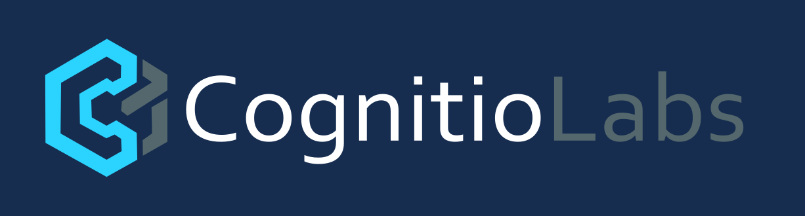

<div align="center">



**CognitioLabs Fine-Tuning Notebook Generator**

[](https://opensource.org/licenses/MIT)
[](https://github.com/cognitiolabs/custom-model-tool)
[](https://nodejs.org/)

*Developed by [CognitioLabs](https://www.cognitiolabs.eu)*

</div>


A CognitioLabs project for producing ready-to-run fine-tuning notebooks together with matching configuration and README sidecars. Learn more about the team at <https://www.CognitioLabs.eu> and follow the work on GitHub at <https://github.com/cognitolabs-ai>.

## Status

- [x] Spec captured in `docs/spec_codex_pomocnik_fine_tuning_app_faza_1_notebook_generator.md`
- [x] Notebook generator, schema validation, and templates implemented under `src/`
- [x] Browser UI available (`pnpm dev:ui`) for interactive bundle creation

## Quick Start

1. Install dependencies (pnpm recommended):
   ```bash
   pnpm install
   ```
2. Generate artifacts for a sample configuration:
   ```bash
   ```
   - Add `--no-zip` to skip creating the ZIP bundle.
   - Point `--config` to any JSON payload that matches `schemas/config.schema.json`.
3. Run tests:
   ```bash
   pnpm test
   ```
4. Launch the browser UI:
   ```bash
   pnpm dev:ui
   ```
   The React wizard uses the same generator core and lets you download the notebook, config, README, and ZIP bundle directly.

## Feature Highlights

- **Unsloth accelerator toggle** for fast LoRA/QLoRA workflows with minimal VRAM usage.
- **Reinforcement learning presets** (GRPO, DPO, ORPO) powered by TRL trainers, configurable entirely from the UI.
- **`torch.compile` integration** with backend/mode selection, driven from the configuration schema.
- **PyTorch profiler instrumentation** (activities, schedules, TensorBoard export) generated inline with the notebook.
- **Tailwind-powered UI refresh** with Inter typography for a modern, accessible configuration experience.

## Documentation

- [Architecture](docs/architecture.md)
- [Operations Guide](docs/operations.md)
- [Configuration Reference](docs/configuration.md)
- Original product spec: [docs/spec_codex_pomocnik_fine_tuning_app_faza_1_notebook_generator.md](docs/spec_codex_pomocnik_fine_tuning_app_faza_1_notebook_generator.md)

## Structure

- `src/` - generator implementation and supporting utilities
- `src/core/templates.ts` - notebook, README, and config templates used for rendering
- `schemas/` - JSON Schemas used for config validation
- `examples/` - sample configs used by docs and tests
- `tests/` - unit and snapshot suites (Vitest)
- `app/` - React UI (Vite) for in-browser configuration and bundle downloads
- `docs/` - project documentation (architecture, configuration, operations, spec)

## Local Testing Loop

- Edit configs under `examples/configs/` (or point the CLI to your own file).
- Run `pnpm generate ...` and open the resulting `fine_tune.ipynb` in Jupyter or Colab to manually validate the workflow.
- Execute `pnpm test` to ensure config validation, template rendering, and bundle creation still behave as expected.
- Use `pnpm dev:ui` to iterate on the wizard while inspecting generated artifacts instantly.

## Docker\n\n### Docker Compose

Use the provided `docker-compose.yml` for quick experiments:

```bash
# Spin up the UI preview
docker compose up ui

# Run a one-off CLI generation job
docker compose run --rm cli
```

The compose services rely on the same Dockerfile; consult [docs/docker.md](docs/docker.md) for details.

Build and run the notebook generator inside a container:

```bash
# Build image (includes CLI + static UI)
docker build -t codex-notebook-generator .

# Run CLI (mount config + output directories)
docker run --rm \
  -v "$PWD/examples:/workspace/examples" \
  -v "$PWD/tmp:/workspace/tmp" \
  codex-notebook-generator \
  cli --config examples/configs/full.json --out tmp/run_full

# Serve the UI (uses vite preview)
docker run --rm -p 4173:4173 codex-notebook-generator ui
```

See [docs/docker.md](docs/docker.md) for advanced scenarios, environment variables, and production deployment guidance.

## Continuous Integration

GitHub Actions workflow (`.github/workflows/ci.yml`) installs dependencies, runs unit tests, builds the CLI/UI bundles, and exercises the Docker image on every push and pull request.

See the spec in `docs/` for detailed requirements and acceptance criteria.


